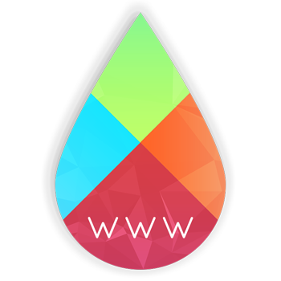
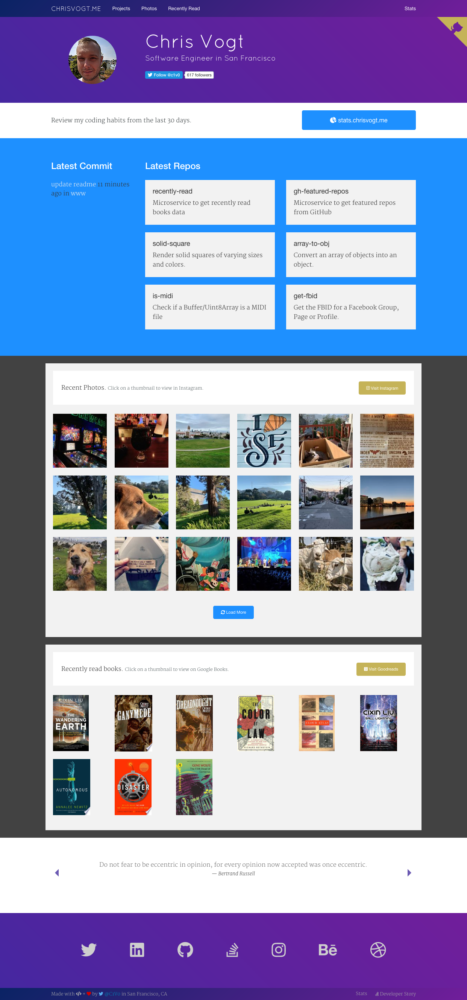

  

My personal website and blog, current a Jekyll + ES7 website deployed to GitHub Pages.

This is an open source project. I plan to make it fully customizable by [`v1.0.0`](https://github.com/chrisvogt/www/milestone/1) so others can spin up their own sites using this template.

_View live at [www.chrisvogt.me](https://www.chrisvogt.me)._

### How to use

###### Install dependencies

* `gem install bundler && npm install`

###### Develop

* `npm run start`

###### Build

* `npm run build`

###### Deploy

Builds output to _/_build_. This currently must be manually deployed.

### Screenshot

### License

[MIT](LICENSE) © [Chris Vogt](https://www.chrisvogt.me).

### Built with

  
  
  
	
  
	

